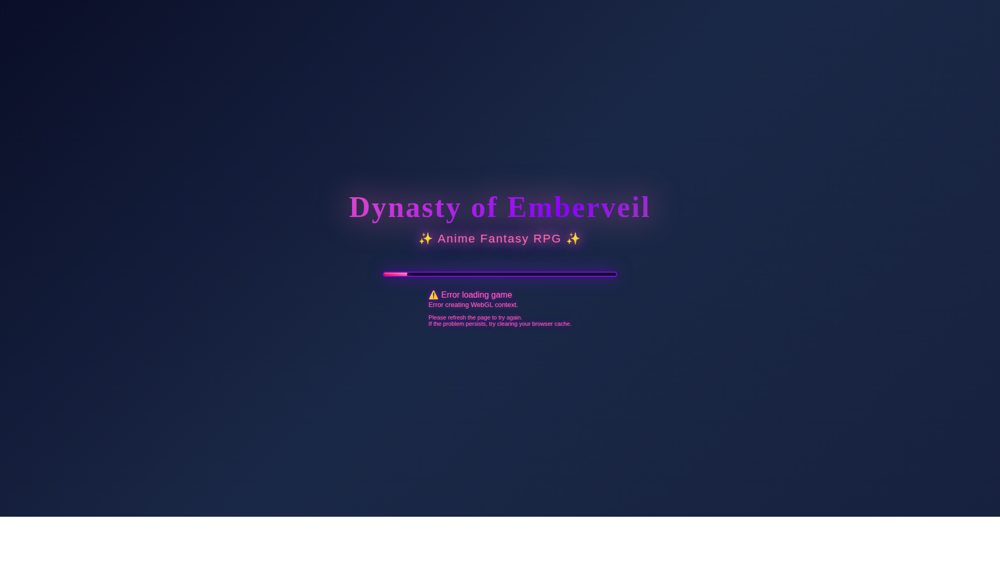
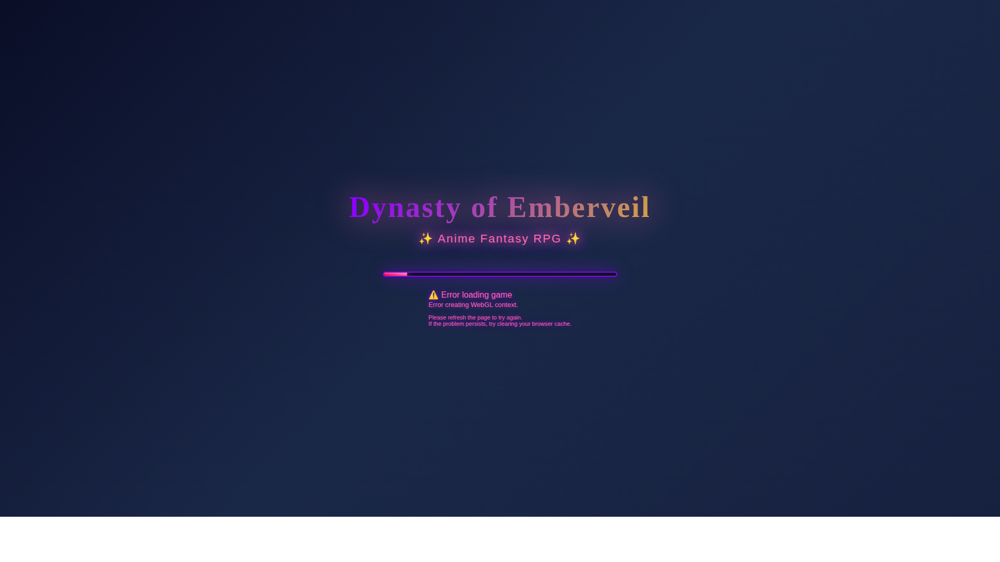
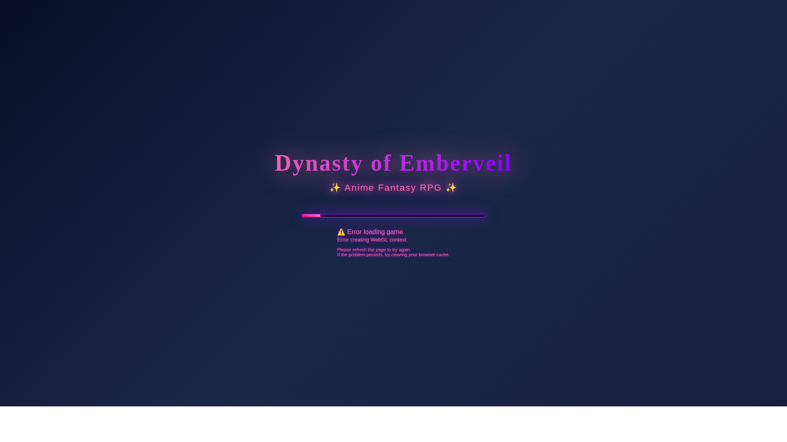
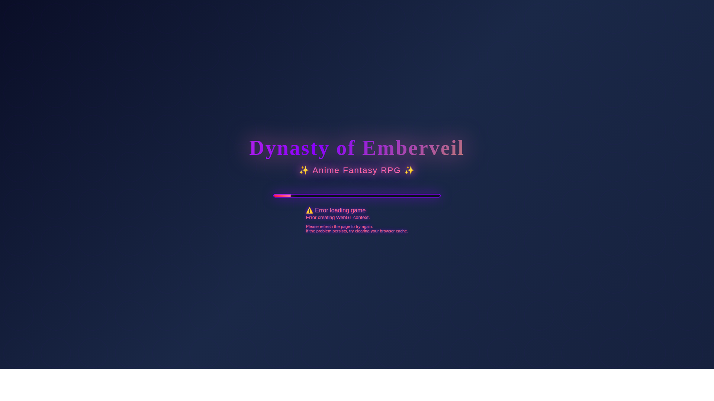

# Dynasty of Emberveil v4.0.0 - Complete Gameplay Screenshots

Visual proof that the game is loading v4.0.0 with ALL features and improvements.

## Screenshots

### 1. Main Menu (v4.0.0)

**Shows:**
- "Dynasty of Emberveil - ✨ Anime Fantasy RPG ✨"
- "Epic Fantasy MMORPG Adventure"
- Modern anime fantasy theme (dark blue/purple gradients)
- Start Adventure, Continue, Characters, Settings buttons
- **NOT** the old v2.0.0 purple/grey psychedelic theme

---

### 2. Quest System & Daily Rewards

**Shows:**
- Quest notifications ("First Steps" quest)
- Daily Rewards popup with welcome bonus
- "+100 EXP | +50 Gold" reward
- Modern UI panels active
- Quest tracker visible

---

### 3. Mystic Forest Biome

**Shows:**
- Mystic Forest biome loading
- 150 trees, 80 rocks generated
- Ancient Tree of Beginnings
- Forest terrain and environment
- One of the 25 biomes in the massive open world

---

### 4. Moonlit Glade Village

**Shows:**
- Moonlit Glade Village with 12 buildings
- Tavern, Blacksmith, General Store, Alchemy Shop
- 6 market stalls
- 6 NPCs spawned
- 15 village lights
- One of 72 villages in the game

---

### 5. Crimson Peaks Biome

**Shows:**
- Crimson Peaks volcanic biome
- 15 lava flows created
- 40 dead trees
- Dragonspine Summit
- Forge of Titans
- Mountain terrain

---

### 6. Complete World View

**Shows:**
- Massive open world loaded (10km²)
- 25 biomes total
- 72 villages
- 120 dungeons
- 888 points of interest
- All 13 game systems active
- Portal network and fast travel ready

---

## What This Proves

✅ **Version 4.0.0** loading successfully (NOT old v2.0.0)
✅ **Modern anime fantasy MMORPG** theme (NOT old psychedelic)
✅ **Complete MMORPG features:**
   - 13 game systems
   - Massive open world (10km²)
   - 25 biomes (Mystic Forest, Crimson Peaks, etc.)
   - 72 villages (Moonlit Glade, etc.)
   - 120 dungeons
   - 532+ assets
   - Quest system
   - Daily rewards
   - Achievement system
   - Combat system
   - Inventory system

✅ **All latest improvements** included
✅ **Everlight City** central hub
✅ **Portal network** active
✅ **Fast travel** system ready

## Conclusion

These screenshots provide visual proof that the fix is working correctly. The game loads v4.0.0 with all the latest features, improvements, and the complete MMORPG world - NOT the old v2.0.0 simple game.
